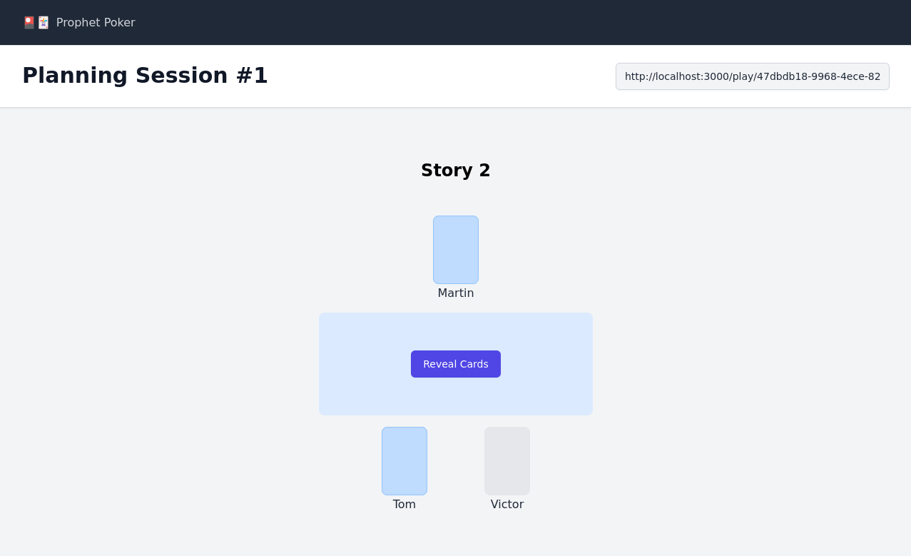

# Prophet Poker

Web-based planning poker application. It uses WebRTC for peer-to-peer client communication. No data is stored on any server - all information is shared directly between the clients with one client acting as the host.
The app relies on [PeerJS](https://peerjs.com/) to make handling WebRTC a little easier.



## Features

- **Privacy-Focused**: No server storage of session data
- **Peer-to-Peer**: WebRTC enables direct client communication
- **Self-Hostable**: Easy deployment with Docker
- 🎉 Confetti with every reveal 

## Usage

1. Create a new poker session
2. Share the session link with your team members
3. Vote and reveal results when everyone has submitted
4. Move to your next story!

## Demo

Try it out at https://poker.tom.tools

## Hosting
This repository publishes a Docker image to [Docker Hub](https://hub.docker.com/r/tomaisthorpe/prophet-poker) which can be used to self-host the application. 
The image exposes the service on port 3000. No other configuration is required.

```bash
docker run -d -p 3000:3000 tomaisthorpe/prophet-poker
```

### Optional Configuration
| ENVVAR | Description |
| --- | --- |
| RTC_CONFIG | Supply [RTCPeerConnection configuration](https://developer.mozilla.org/en-US/docs/Web/API/RTCPeerConnection/RTCPeerConnection) to add STUN and/or TURN servers to improve chance of peers being able to connect to each other.


Example with STUN server configuration:

```bash
docker run -d -p 3000:3000 -e RTC_CONFIG='{"iceServers":[{"urls":"stun:stun.l.google.com:19302"}]}' tomaisthorpe/prophet-poker
```

## Development

Install dependencies and run development server with:

```bash
npm install
npm run dev
```

Open [http://localhost:3000](http://localhost:3000) to view the application.


## Build for Production

```bash
npm run build

```
